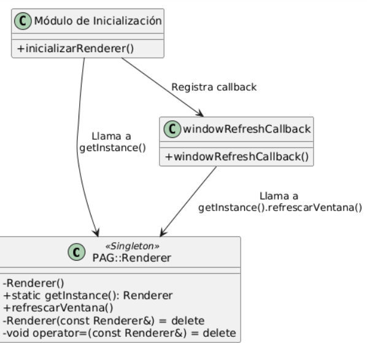

# PAG-mss00048

# Autor:
- [Manuel Sánchez Salazar](mailto:mss00048@red.ujaen.es)
- [Perfil GitHub](https://github.com/DRUBRoxas/PAG-mss00048)

# Descripción:
Este repositorio contiene la práctica de la asignatura Programacion de Aplicaciones Gráficas.

# Practica 1:
## Ejercicio 1
Se ha realizado una función que permite que, al mover la rueda del ratón se genere un color aleatorio y se cambie el color de fonde del programa
## Ejercicio 2
Utilizar un Singleton puede ser una buena solución para este caso, ya que garantiza que haya una única instancia
de la clase PAG::Renderer en toda la aplicación y facilita el acceso global a esa instancia desde cualquier parte, 
incluyendo funciones de C registradas como callbacks.
Para implementar un singleton, necesitas:
* La clase tenga un único punto de acceso.
* El constructor sea privado, para que no se puedan crear más instancias.
* Se proporcione un método estático para obtener la instancia única.




Esto puede presentar las siguientes ventajas:
* Simplicidad en el código.
* Acceso global controlado.
* Encapsulamiento.


# Practica 2:
## Ejercicio 1
La clase PAG::Renderer ha sido completada, se han añadido los siguientes cambios:


## Ejercicio 2
Se han sustituido todas las llamadas a openGL en el main por llamadas a PAG::Renderer
## Ejercicio 3
Todos los mensajes han sido añadidos a la consola de Dear imgui y para el selector de color
se ha elegido un ColorPicker4, había varias opciones a elegir, y otras versiones de este mismo,
he usado esta porque me parece la mas sencilla y la que mejor se adapta a lo que necesitamos.
Para usarla se ha utilizado la flag:
```cpp
ImGuiColorEditFlags_PickerHueWheel
```
Hay muchas mas flags que permiten la modificación al gusto del selector del color, pero he decidido
usar solo esta por ahora.